### **Technical Documentation**

Our system architecture is designed for rapid development and scalability, centered around a serverless backend.

  * **System Architecture**: The frontend is a **React Native (Expo)** mobile application. The backend is powered by **Supabase**, which provides the PostgreSQL database, user authentication, and real-time capabilities. For AI-driven wellness coaching, we integrated **Google's Gemini 1.5 API**, and for exercise detection, we use **MediaPipe** for real-time computer vision.

  * **Database Schema**: The core of our data model resides in a PostgreSQL database managed by Supabase. The primary tables include:

      * `users`: Stores user profiles, authentication details, and gamification stats (coins, level, streaks).
      * `wellness_activities`: Logs every completed activity, such as AR yoga sessions or meditation, linking back to the user and recording the coins earned.
      * `insurance_policies`: Manages the user's insurance data, including the base premium and dynamic discounts calculated from their wellness activities.

  * **API Specifications**: Since we use the Supabase client-side library, our "APIs" are structured as service functions within the application. Key functions include:

      * **User Management**: `signup(SignupData)` for new user registration and profile creation.
      * **Gamification Service**: `awardCoins(amount, reason)` which handles awarding coins with a randomized variance to increase engagement and checks for level-ups or new badges.
      * **Activity Tracking**: `logARSession(ARSessionResult)` to save the results of an AR yoga session, including duration, accuracy, and coins earned.

-----

### **User Experience Documentation**

Our UX is designed to be engaging and intuitive, turning wellness into a rewarding game.

  * **Wireframes**: High-fidelity prototypes and UI mockups were created to visualize the entire user journey, from onboarding to daily wellness tasks.

  * **User Stories**:

      * **Onboarding**: "As a new user, I want a quick and interactive walkthrough so I can understand how earning coins and completing streaks can lower my insurance premium."
      * **Daily Engagement**: "As a returning user, I want to see personalized wellness tasks and my progress at a glance so I can stay motivated to maintain my daily streak."
      * **AR Exercise**: "As a user doing home workouts, I want real-time feedback on my yoga pose so I can correct my form and get the maximum reward for my effort."

  * **Accessibility Considerations**: We've focused on creating a clear and simple UI. By using large, legible fonts, high-contrast color schemes, and standard mobile navigation patterns, we aim to make the app accessible to a broad audience, including users with visual impairments. Haptic feedback is used to confirm rewards and successful actions.

-----

### **Business Case Analysis**

YouMatter bridges the gap between wellness and insurance, creating a powerful value proposition for both users and providers.

  * **ROI Projections**: Our model projects significant growth. By the end of Year 3, we project reaching **100,000 users** with a 22% conversion rate to our premium plan, generating an **annual revenue of $3,000,000**. The primary value for insurance partners is a reduction in claims, leading to a direct and measurable ROI.

  * **User Acquisition Cost Impact**: We plan a multi-channel acquisition strategy.

      * **Insurance Partner Referrals**: This is our most effective channel, with a high conversion rate (45%) and an estimated **Cost Per Acquisition (CPA) of $25**.
      * **Corporate Partnerships**: B2B sales provide a lower CPA ($8) and higher lifetime value (LTV).
      * **Social Media Ads**: Targeted ads on platforms like Instagram and Facebook will have an estimated CPA of $15.

  * **Retention Modeling**: Our strategy is built on principles of behavioral psychology to keep users engaged.

      * **Gamification**: The core driver, featuring variable rewards, daily streaks, and badges, is projected to increase 30-day retention by 40%.
      * **Personalized AI**: The AI wellness coach provides tailored advice and motivation, expected to increase daily active users by 25%.
      * **Financial Incentive**: The direct link to insurance premium reduction is the strongest long-term retention mechanic, offering tangible financial rewards for sustained engagement.

-----

### **Implementation Roadmap**

We've designed a phased rollout plan to ensure a stable launch and strategic growth.

  * **Phase 1: Foundation (Months 1-6)**

      * **Plan**: Complete the core application, including the gamification engine, AR pose detection, and AI chat. Secure a pilot partnership with a regional insurer. Launch a beta program with up to 500 users.
      * **Timeline**: 6 months.
      * **Resources**: A core team of 5 developers (2 frontend, 2 backend, 1 ML/AR specialist).

  * **Phase 2: Market Entry (Months 7-12)**

      * **Plan**: Launch the app publicly on iOS and Android. Integrate with the first insurance partner's system. Develop and launch a corporate wellness pilot program.
      * **Timeline**: 6 months.
      * **Resources**: Scale the team to 12 developers to support multi-platform development and partnership integrations.

  * **Phase 3: Scale and Expansion (Year 2)**

      * **Plan**: Expand to a web application. Integrate with popular wearable devices (e.g., Apple Watch). Secure partnerships with 3-5 major national insurers and scale the corporate wellness offerings.
      * **Timeline**: 12 months.
      * **Resources**: Grow the development team to 25+ members, organized into dedicated feature teams (e.g., AI, Corporate, Analytics).

### Wireframe screenshots
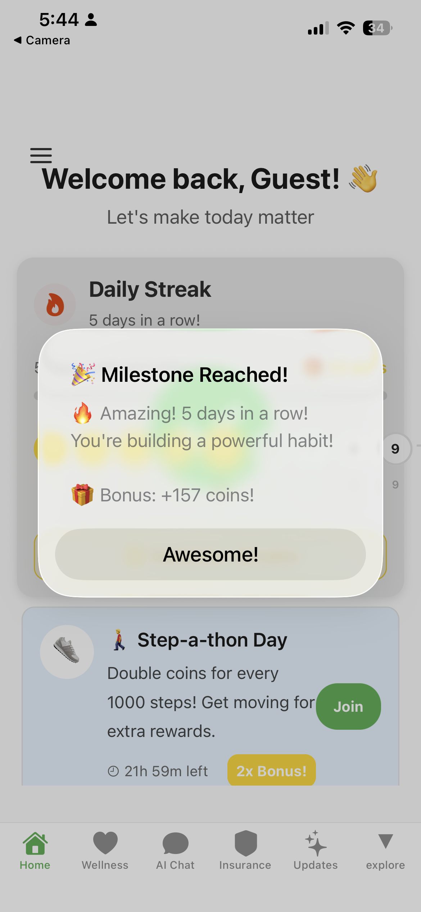 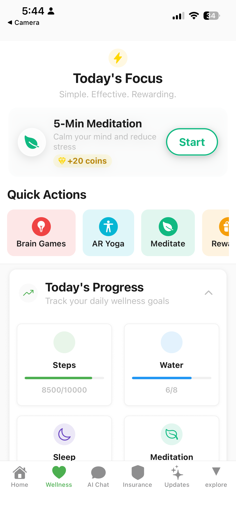 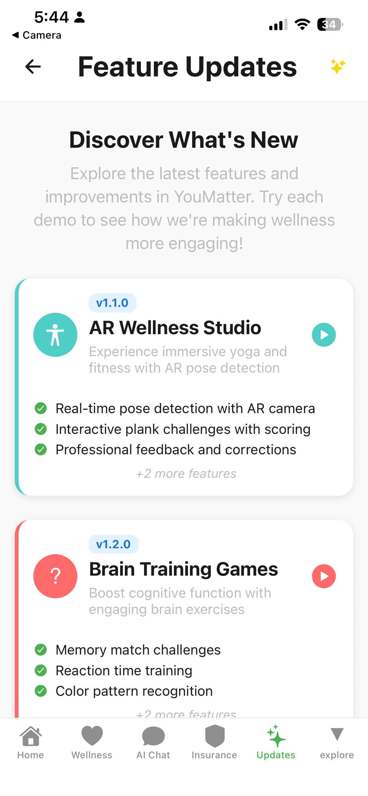 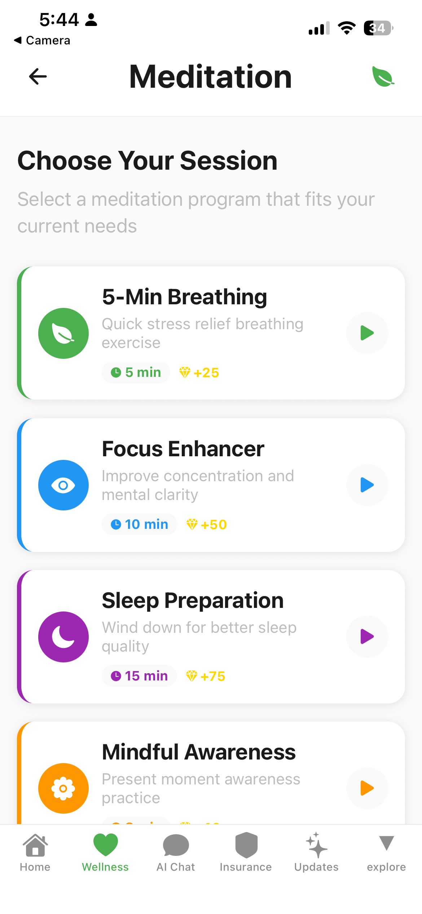 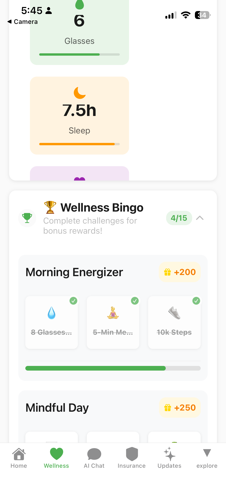 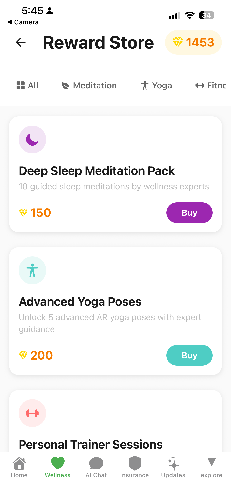 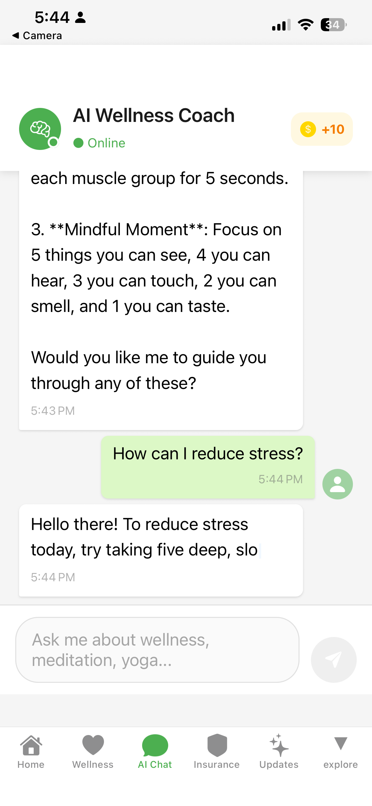 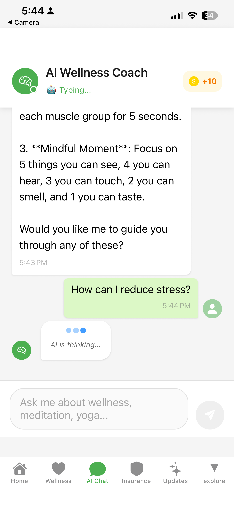 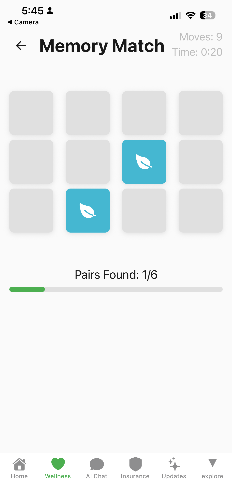 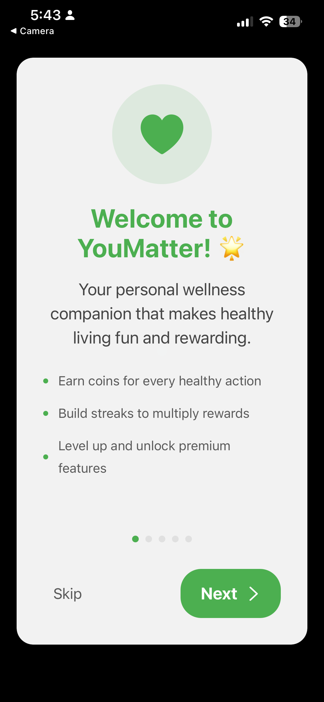 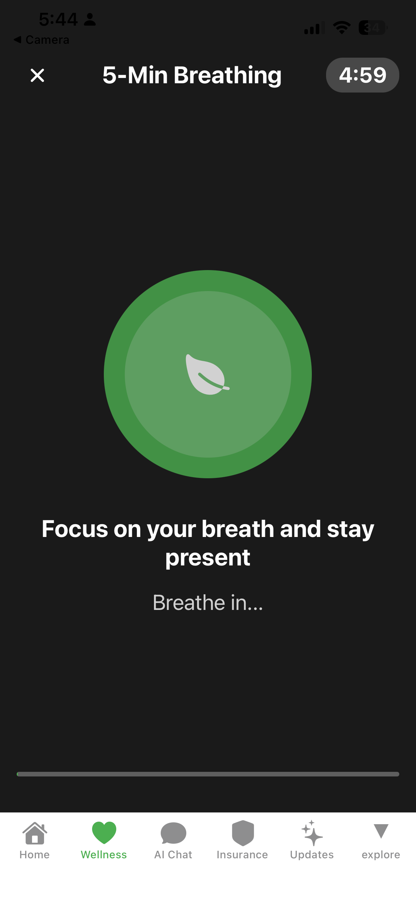
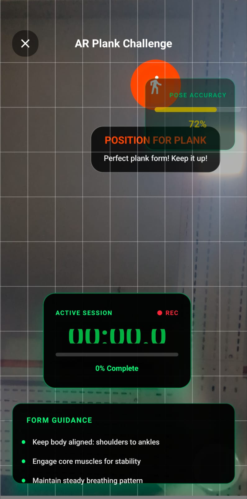
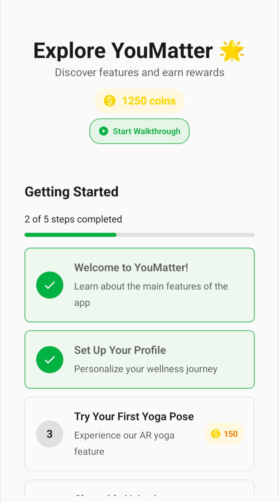
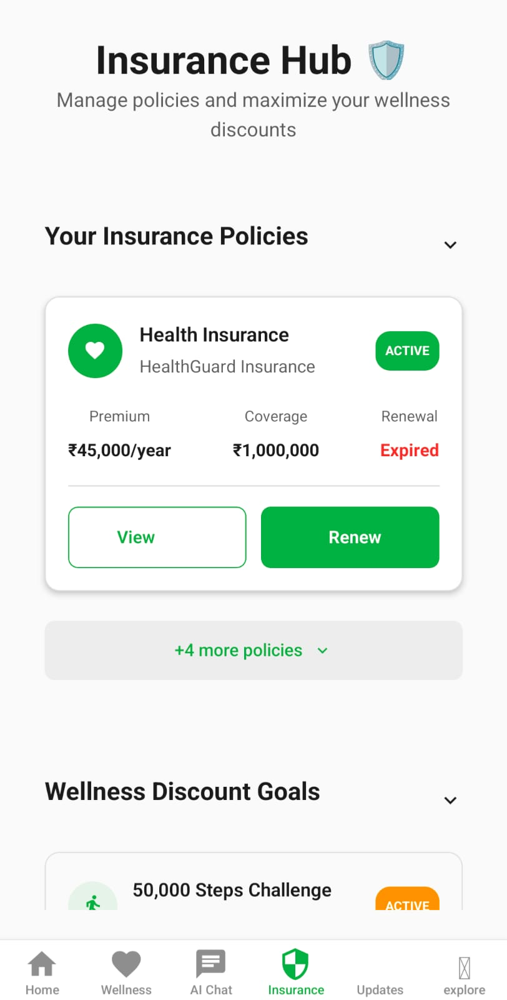

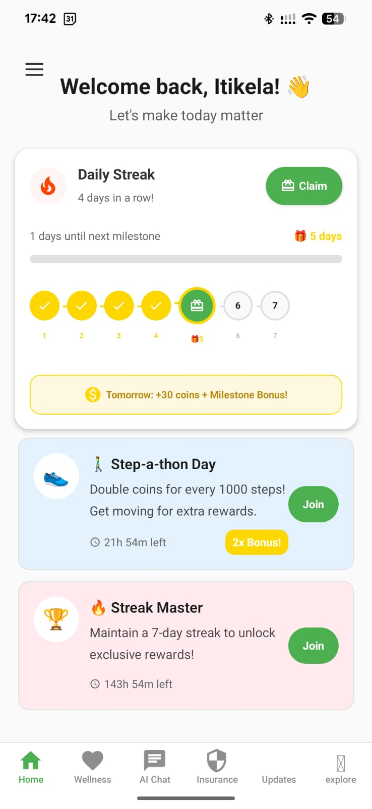